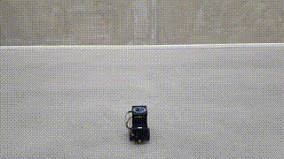
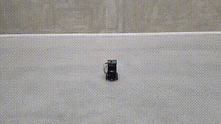
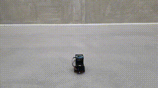
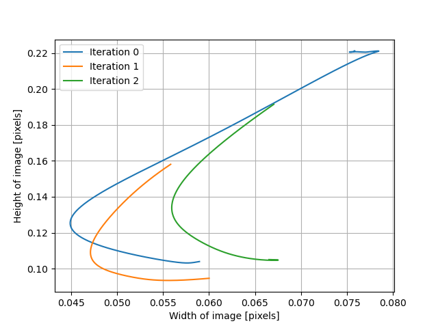
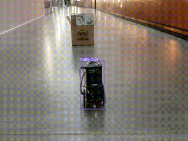
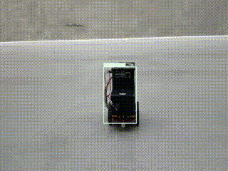
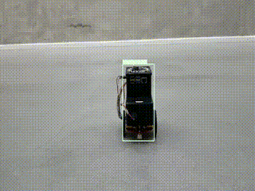
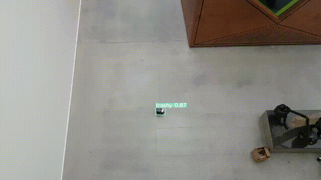

# Experiments

## Test 01 - Simple Obstacle Avoidance with Wall

| Iteration 1 | Iteration 2 | Iteration 3 |
|:-----------:|:-----------:|:-----------:|
|  |  |  |

| Trajectory |
|:----------:|
|  |

## Test 02 - Left Obstacle Avoidance with Box

| Iteration 1 | Iteration 2 | Iteration 3 | Iteration 4 |
|:-----------:|:-----------:|:-----------:|:-----------:|
|  |  |  |  |

| Trajectory |
|:----------:|
|  |

## Test 03 - Right Obstacle Avoidance with Box

| Iteration 1 | Iteration 2 | Iteration 3 |
|:-----------:|:-----------:|:-----------:|
|  |  |  |

| Trajectory |
|:----------:|
|  |

## Test 04 - Left Obstacle Avoidance with Wall

| Iteration 1 | Iteration 2 | Iteration 3 | Iteration 4 | Iteration 5 | Iteration 6 |
|:-----------:|:-----------:|:-----------:|:-----------:|:-----------:|:-----------:|
|  |  |  |  |  |  |

| Trajectory |
|:----------:|
|  |

## Test 05 - Right Obstacle Avoidance with Wall

| Iteration 1 | Iteration 2 | Iteration 3 | Iteration 4 |
|:-----------:|:-----------:|:-----------:|:-----------:|
|  |  |  |  |

| Trajectory |
|:----------:|
|  |